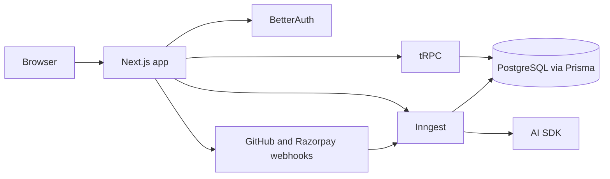

# Forge AI Architecture

This document summarizes the structure of the repo and the main runtime boundaries.

## Implementation status

| Area | Status |
| --- | --- |
| Auth (BetterAuth + GitHub OAuth) | ✅ shipped |
| Multi-tenant workspaces + memberships + invites | ✅ shipped |
| Feature requests + AI discovery / clarification | ✅ shipped |
| PRD generation + versioned editor + approval gate | ✅ shipped |
| Task generation + Kanban board with drag-and-drop | ✅ shipped |
| GitHub integration: OAuth, repo connect, signed webhooks | ✅ shipped |
| AI review loop: PR → diff → review → blocking/non-blocking issues | ✅ shipped |
| Human approval + release shipping | ✅ shipped |
| Billing: Razorpay subscriptions, credit ledger, signed webhooks | ✅ shipped |
| Marketing landing page, dashboard with live metrics | ✅ shipped |
| Toast notifications (Sonner) wired into every mutation | ✅ shipped |
| Workspace settings page (rename + members + invites) | ✅ shipped |
| Demo seed script for end-to-end walkthrough | ✅ shipped |
| Vercel deploy config | ✅ shipped |

## Goals

| Goal | Reason |
| --- | --- |
| Type-safe end to end | Catch issues across UI, API, and jobs earlier |
| Async first | AI and GitHub workflows are too slow for request/response |
| Multi-tenant by default | Every business entity must be workspace scoped |
| Webhook driven | Real GitHub and Razorpay events must drive state |
| Observable | The app should show workflow progress at every step |

## System Topology



## Monorepo Layout

```text
apps/web
packages/api
packages/ai
packages/auth
packages/billing
packages/config
packages/db
packages/github
packages/inngest
packages/ui
```

## Request Flow

1. The browser submits a feature request.
2. tRPC persists the request and triggers an Inngest workflow.
3. AI generates clarifying questions or a PRD.
4. Tasks are generated and tracked in the database.
5. GitHub webhooks update pull request state.
6. AI reviews compare the PR diff with the PRD and tasks.
7. A human reviewer approves or rejects the release.

## Multi-Tenancy

- Every business table carries a `workspaceId`.
- tRPC procedures should verify membership before reading or writing tenant data.
- Roles are `OWNER`, `ADMIN`, `MEMBER`, and `REVIEWER`.

## Workflow Phases

### Discovery

The discovery phase collects the initial request, asks follow-up questions when context is missing, and detects duplicates when possible.

### PRD Generation

The AI converts the approved discovery output into a structured PRD with problem statement, goals, non-goals, user stories, acceptance criteria, edge cases, and success metrics.

### Task Planning

Approved PRDs are broken into implementation tasks and organized for Kanban-style tracking.

### GitHub Review Loop

Webhook events from GitHub create and update pull request records. Inngest fetches changed files, builds an AI review prompt, and records issues that are blocking or non-blocking.

### Human Approval

Humans remain the final gate for release. The reviewer sees the PRD, tasks, PR history, review history, and current release state in one view.

## Data Model Summary

- Auth tables: `User`, `Account`, `Session`, `Verification`
- Org tables: `Workspace`, `Membership`
- Delivery tables: `Project`, `FeatureRequest`, `ClarifyMessage`, `PRD`, `Task`
- GitHub tables: `Repository`, `PullRequest`, `PullRequestFile`
- Review tables: `AIReview`, `ReviewIssue`

## Runtime Boundaries

- `apps/web` owns routes, UI, and webhook handlers.
- `packages/api` owns shared tRPC routers.
- `packages/db` owns Prisma schema and client creation.
- `packages/ai` owns schemas and AI prompt contracts.
- `packages/inngest` owns long-running workflow functions.
- `packages/github` owns GitHub helpers and signature verification.
- `packages/billing` owns plan metadata.
- `packages/ui` owns shared UI helpers.

## Notes

- The repo is intentionally scaffolded so each product phase can be filled in incrementally.
- The current codebase uses placeholders for external integrations until real credentials and app setup are added.

```
[Reviewer page]
  loads: PRD (latest) + Tasks + PullRequest + AIReview history + open ReviewIssues
  shows: approval buttons (gated by role)
         │
         ▼
[Approve clicked]
  → feature.status = APPROVED
  → "Ship" button revealed
         │
         ▼
[Ship clicked]
  → feature.status = SHIPPED
  → optional: octokit.repos.createRelease({ tag_name: "feature-<id>", body: prdSummary })
```

---

## 7. AI Layer — Prompt & Schema Discipline

Every AI call follows the same shape:

```ts
// packages/ai/src/prompts/review.ts
export const reviewPrompt = (ctx: ReviewContext) => `
You are a senior staff engineer reviewing a pull request.

PRD:
${JSON.stringify(ctx.prd, null, 2)}

TASKS:
${JSON.stringify(ctx.tasks, null, 2)}

CHANGED FILES (truncated diff):
${ctx.diff}

REPO CONTEXT:
${ctx.repoSummary}

Instructions:
1. For each issue you find, cite the PRD section it relates to.
2. Classify severity as BLOCKING only if it prevents the feature from satisfying its acceptance criteria, or introduces a security / data-loss risk.
3. Provide a concrete code suggestion for fixable issues.
4. Score PRD coverage 0-100 based on how many acceptance criteria the diff demonstrably satisfies.
5. Set readyForHumanReview=true only when there are no BLOCKING issues.
`;
```

```ts
// packages/ai/src/schemas/review.ts
export const reviewSchema = z.object({
  issues: z.array(z.object({
    severity: z.enum(["BLOCKING", "NON_BLOCKING"]),
    category: z.enum(["PRD", "SECURITY", "PERFORMANCE", "EDGE_CASE", "QUALITY"]),
    file: z.string().optional(),
    line: z.number().int().positive().optional(),
    message: z.string().min(10),
    suggestion: z.string().optional(),
    prdReference: z.string().optional(),
  })),
  overallSummary: z.string().min(20),
  prdCoverageScore: z.number().int().min(0).max(100),
  readyForHumanReview: z.boolean(),
});
```

`generateObject({ schema: reviewSchema, ... })` from the AI SDK guarantees a typed, validated response. Invalid → one retry → surface as workflow error if still bad.

---

## 8. Async Workflow Observability

We mirror Inngest run state into our DB so the UI doesn't depend on Inngest's external API:

```
table InngestRun {
  id           PK
  workspaceId  FK
  entityType   enum (FEATURE, PRD, TASKS, REVIEW, RELEASE)
  entityId     string
  inngestRunId string  -- Inngest's own ID
  status       enum (PENDING, RUNNING, COMPLETED, FAILED)
  error        text?
  startedAt    timestamp
  finishedAt   timestamp?
}
```

Each Inngest function's first step writes a `RUNNING` row; the last step writes `COMPLETED` (or the failure handler writes `FAILED`). UI subscribes via tRPC `runs.forEntity({ type, id })` polled every 1-2s while `RUNNING`.

---

## 9. Security

| Concern | Mitigation |
|---|---|
| Cross-tenant data leak | `workspaceProcedure` middleware + every Prisma query filtered by `workspaceId` + integration test |
| Webhook spoofing | HMAC-SHA256 signature verify on GitHub + Razorpay; constant-time compare |
| AI prompt injection (via PR diff or feature title) | Treat all user/diff content as untrusted; never let it override system prompt instructions; structured output schema rejects injected directives |
| Secret leakage in logs | Centralized logger redacts `*_SECRET`, `*_KEY`, `Authorization` |
| CSRF | tRPC mutations require BetterAuth session cookie (SameSite=Lax) |
| Auth bypass | All `/app` routes guarded by middleware; tRPC `protectedProcedure` checks session |
| GitHub token misuse | Tokens stored encrypted at rest (Postgres pgcrypto); never logged |
| Razorpay replay | Use `razorpay_payment_id` as idempotency key |
| Rate limiting | Upstash Redis token bucket on tRPC mutations (per workspace) — stretch goal |

---

## 10. Performance & Cost

- **AI cost:** Discovery + duplicate detection use `gpt-4o-mini` (cheap). Heavy reasoning (PRD, review) uses `gpt-4o`. Token budget per review capped at 8k input.
- **Diff truncation:** Files > 500 LOC of changes are summarized first by `gpt-4o-mini` then fed to the main review.
- **DB:** Neon pooled URL via PgBouncer. Prisma `connection_limit=1` per serverless function instance.
- **Inngest:** Free tier (50k steps/mo) is plenty for hackathon scale.
- **Vercel:** Next.js 15 RSC keeps client bundles small. Edge runtime for webhooks (lower cold start).

---

## 11. Testing Strategy (lean for hackathon)

- **Unit:** Zod schemas, prompt builders, HMAC verify (Vitest).
- **Integration:** tRPC routers against a test Postgres (Docker). Multi-tenancy isolation test.
- **E2E smoke:** Playwright script that runs the full loop with mocked AI + GitHub clients.
- **Manual demo script:** see `DEMO_SCRIPT.md`.

---

## 12. Decisions Log

| Decision | Alternative | Why we chose it |
|---|---|---|
| Turborepo | Nx | Lighter, matches Vercel's own examples |
| Prisma | Drizzle | Mature multi-tenant patterns, Prisma Studio is great for demos |
| BetterAuth | Auth.js / Clerk | Brief mandates BetterAuth; great DX, free |
| Inngest | BullMQ / Trigger.dev | Brief mandates Inngest; zero infra |
| OpenAI primary | Anthropic / Gemini | Best general perf, simplest setup; AI SDK lets us swap later |
| tRPC | REST | Brief mandates tRPC; type safety is huge win |
| Neon Postgres | Supabase / RDS | Free, serverless, fits Vercel perfectly |
| GitHub OAuth (initial) | GitHub App | Faster to set up for hackathon; App is a v2 upgrade |
| Razorpay test mode for demo | Live mode | India-only friction; brief allows test creds |

---

## 13. Future Hardening (post-hackathon)

- Move Octokit calls behind a queue with per-installation rate limit awareness.
- Add pgvector to Neon for semantic duplicate detection.
- Move webhooks to Edge runtime + queue persistence for replay.
- Workspace-level data export (GDPR).
- Self-hostable Docker image with Postgres + Inngest dev server.
