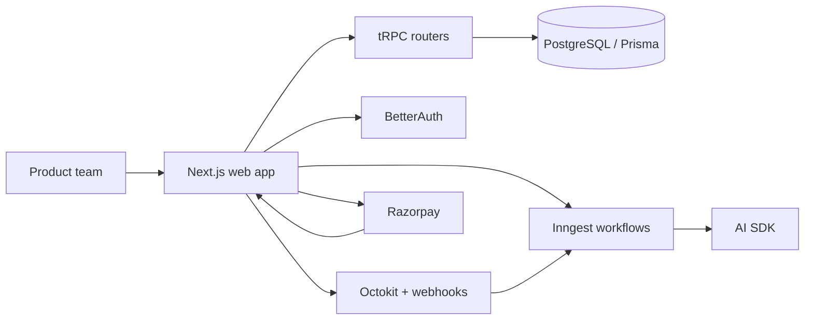

# Forge AI

Forge AI is an AI-powered product delivery platform that moves a feature request from discovery to production through a structured workflow.

## Project Overview

The platform supports multi-tenant workspaces, feature intake, PRD generation, task planning, GitHub pull request tracking, AI review loops, human approval, and release shipping.

## Tech Stack

| Layer | Choice |
| --- | --- |
| Monorepo | Turborepo + pnpm |
| Web app | Next.js App Router |
| API | tRPC |
| Auth | BetterAuth |
| Database | PostgreSQL |
| ORM | Prisma |
| UI | Tailwind CSS + Shadcn UI |
| AI | Vercel AI SDK |
| Async workflows | Inngest |
| GitHub integration | Octokit + GitHub webhooks |
| Billing | Razorpay |
| Deploy | Vercel |

## Architecture



## Monorepo Structure

```text
forge-ai/
├── apps/
│   └── web/
├── packages/
│   ├── ai/
│   ├── api/
│   ├── auth/
│   ├── billing/
│   ├── config/
│   ├── db/
│   ├── github/
│   ├── inngest/
│   └── ui/
├── .env.example
├── ARCHITECTURE.md
├── DEMO_SCRIPT.md
├── README.md
└── todo.md
```

## Setup Instructions

### Prerequisites

- Node.js 20+
- pnpm 9+
- PostgreSQL 15+ or Neon
- OpenAI, Inngest, Razorpay, and GitHub credentials

### Install

```bash
pnpm install
```

### Configure environment

```bash
cp .env.example .env.local
```

### Database

```bash
pnpm db:generate
pnpm db:push
```

### Run locally

```bash
pnpm dev
```

## Environment Variables

See [`.env.example`](.env.example) for the full list. The required values include database URLs, BetterAuth secrets, GitHub OAuth credentials, OpenAI, Inngest, Razorpay, and encryption settings.

## Database Schema Notes

- All business entities are scoped by `workspaceId`.
- Core tables include `Workspace`, `Membership`, `Project`, `FeatureRequest`, `PRD`, `Task`, `Repository`, `PullRequest`, `AIReview`, and `ReviewIssue`.
- BetterAuth tables are included in the Prisma schema.

## GitHub Integration Setup

- Create a GitHub OAuth app or GitHub App.
- Add the callback URL from `.env.example`.
- Register webhook endpoints for pull request and push events.
- Verify webhook signatures before accepting events.

## Inngest Workflow Explanation

Inngest handles long-running workflows for request clarification, PRD generation, task generation, pull request review, and release readiness checks.

## AI Features Implemented

- Requirement clarification and duplicate detection
- PRD generation
- Task generation
- Repository and diff analysis
- AI code review against PRD and acceptance criteria
- Release readiness checks

## Scripts

```bash
pnpm dev
pnpm build
pnpm lint
pnpm typecheck
pnpm db:generate
pnpm db:push
```

## Deployment

- Web app: Vercel
- Database: Neon or another managed PostgreSQL service
- Workflow runtime: Inngest Cloud
- Billing: Razorpay test or live mode

## Demo Video

- Demo recording: to be added before submission

## License

Internal hackathon project.
